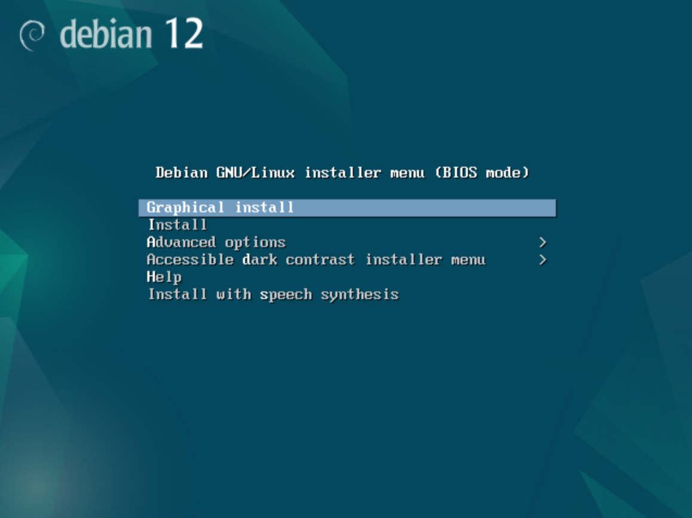

# Projet infrastructure

Bienvenue sur le **guide d'installation** du projet infrastructure du groupe de **Lucas Saillot** et **Louise Ducrocq**.

---

## Objectifs

- Configurer et administrer un serveur pour héberger une solution web.  
- Installer, paramétrer et utiliser des outils fiables et reconnus pour l’hébergement de solutions web.  
- Déployer un site web, comme WordPress, sur le serveur.  
- Automatiser les sauvegardes des fichiers du site et de sa base de données.  
- Rendre la solution web accessible sur un réseau local, à la fois via son adresse IP et un nom de domaine personnalisé.  


---

## Prérequis

Avant de commencer, assurez-vous d'avoir les éléments suivants :

- Avoir un logiciel de virtualisation ou un serveur pour pouvoir installer Debian 12 comme OS.
- Avoir téléchargé l'ISO de Debian 12 ([Télécharger ici](https://www.debian.org/download)).

---

## Étapes d'installation du projet

Suivez les étapes ci-dessous pour installer votre premier serveur.

### 1. Installer l'OS

Booter votre serveur ou machine virtuelle sur l'iso debian, vous devrez arriver sur le même écran affiché ci-dessous.




```bash
# Commande pour cloner le dépôt
git clone https://github.com/utilisateur/mon-projet.git
